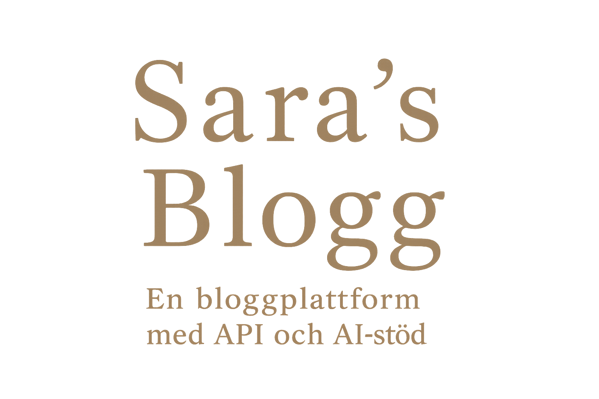

# SarasBlogg

En bloggplattform byggd i **.NET Razor Pages** med ett separat **API-projekt** för databehandling, bildhantering och AI-funktioner.  
Syftet är att skapa en responsiv, säker och utbyggbar blogg för både publikt läsande och avancerad admin-hantering.

🔗 **Live-sida:** [https://sarasblogg.onrender.com](https://sarasblogg.onrender.com)

---

## 🛠 Teknisk översikt
- **Backend:** .NET Razor Pages (C#) + separat API-projekt  
- **Databas:** Entity Framework Core (PostgreSQL/SQL Server)  
- **Frontend:** Bootstrap + anpassad CSS  
- **Hosting:** Webbapp och API på Render (planer på GitHub Pages för frontend)  
- **Kommentarhantering:** AI-analys via Google Perspective API + regex  
- **Kodhantering:** GitHub med aktiv användning av branches  

> **Status:** Nästan all logik och databasanslutning är flyttad till API-projektet.  
> Identity och rollhantering körs redan via API:t – det återstår bara viss kodrensning i frontenden från den första scaffoldningen.

---

## 📌 Funktioner

### För besökare
- Läsa blogginlägg
- Lämna kommentarer (AI- och regex-filtrering)

### Adminfunktioner
- Skapa, redigera, arkivera/dölja blogginlägg  
- Hantera kommentarer och kontaktmeddelanden  
- Rollbaserad åtkomst (User, Superuser, Admin, Superadmin)  
- Inloggning med bekräftad e-post

### Bildhantering
- Bilder sparas i databasen och/eller GitHub-lagring  
- Tidigare bilder raderas automatiskt vid ny uppladdning

---

## 🚀 API-utveckling
- **Separat projekt:** SarasBloggAPI  
- Innehåller AI-analys för kommentarer och bildhantering  
- Identity och rollhantering är flyttat till API:t  
- Mål: Helt API-drivna klienter (t.ex. appar och fristående frontend)

---

## 📂 Strukturen i projektet
SarasBlogg/         # Huvudprojektet med Razor Pages
SarasBloggAPI/      # API-projektet
